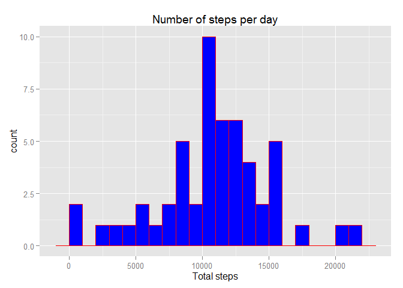
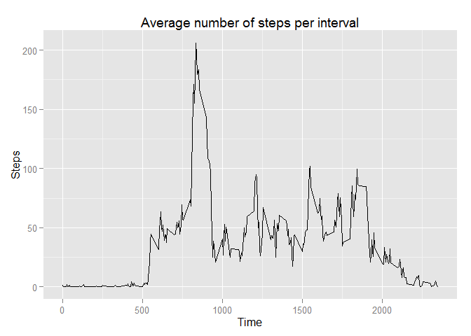
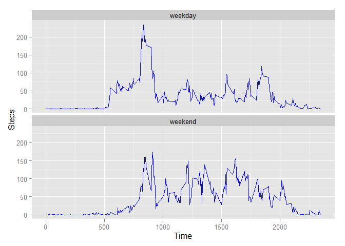

# Reproducible Research: Peer Assessment 1


```r
setwd("G:/documentos/Cursos online/DataScience/RepData_PeerAssessment1")
library(dplyr)
library(ggplot2)
```

## Loading and preprocessing the data
First I unzip the data and load it into R


```r
unzip("activity.zip")
data <- read.csv("activity.csv")
data$date <- as.Date(data$date, "%Y-%m-%d"); 
```

## What is mean total number of steps taken per day?
Using dplyr I sum the number of steps per day and plot an histogram


```r
stepsData  <- data %>% group_by(date) %>% summarise(steps=sum(steps))
qplot(stepsData$steps,
      geom="histogram",
      binwidth = 1000,  
      main = "Number of steps per day", 
      xlab = "Total steps", 
      fill=I("blue"), 
      col=I("red"))
```

 

```r
meanSteps <- mean(stepsData$steps, na.rm = TRUE)
medianSteps <- median(stepsData$steps, na.rm = TRUE)
```

The mean number of steps per day is **1.0766189\times 10^{4}** and the median is **10765**

## What is the average daily activity pattern?
Using dplyr again I average the number of steps per 5 minute interval
and plot the time series


```r
stepsTS <- data %>% group_by(interval) %>% summarise(steps=mean(steps, na.rm = TRUE))
ggplot(stepsTS, aes(interval, steps)) +
       geom_line() +
       ggtitle("Average number of steps per interval") +
       xlab("Time") +
       ylab("Steps")
```

 


```r
maxsteps <- stepsTS[which.max(stepsTS$steps),1]$interval
```

The interval with the maximum average number of steps is 835

## Imputing missing values
Since there are some missing values I calculate the total number of missing values


```r
missing <- sum(is.na(data$steps))
```

There are 2304 missing values in the data. I fill each missing value with the average value for that interval
and repeat the histogram, mean and median calculations

```r
f <- function(t) {stepsTS[t/5 + 1, 2]$steps}
dataFill <- data %>% mutate(steps = ifelse(is.na(steps), f(interval), steps))

stepsData2  <- dataFill %>% group_by(date) %>% summarise(steps=sum(steps))
qplot(stepsData2$steps,
      geom="histogram",
      binwidth = 1000,  
      main = "Number of steps per day", 
      xlab = "Total steps", 
      fill=I("blue"), 
      col=I("red"))
```

 

```r
meanSteps2 <- mean(stepsData$steps, na.rm = TRUE)
medianSteps2 <- median(stepsData$steps, na.rm = TRUE)
```

The mean is now **1.0766189\times 10^{4}** and the median **10765** and are almost identical to the previous values.


## Are there differences in activity patterns between weekdays and weekends?

Using the weekdays function I separate and summarise the data between weekdays and weekends, then plot
a time series for each case.


```r
weekend <- weekdays(data$date) %in% c("sábado", "domingo")
data[!weekend, "weekdays"] <- c("weekday")
data[weekend, "weekdays"] <- c("weekend")
data$week <- factor(data$week)

stepsWeek <- data %>% group_by(week, interval) %>% summarise(steps=mean(steps, na.rm = TRUE))

ggplot(stepsWeek, aes(x = interval, y = steps)) + 
       geom_line(colour = "blue") +
       facet_wrap(~week, nrow = 2) +
       xlab("Time") +
       ylab("Steps")
```

 

